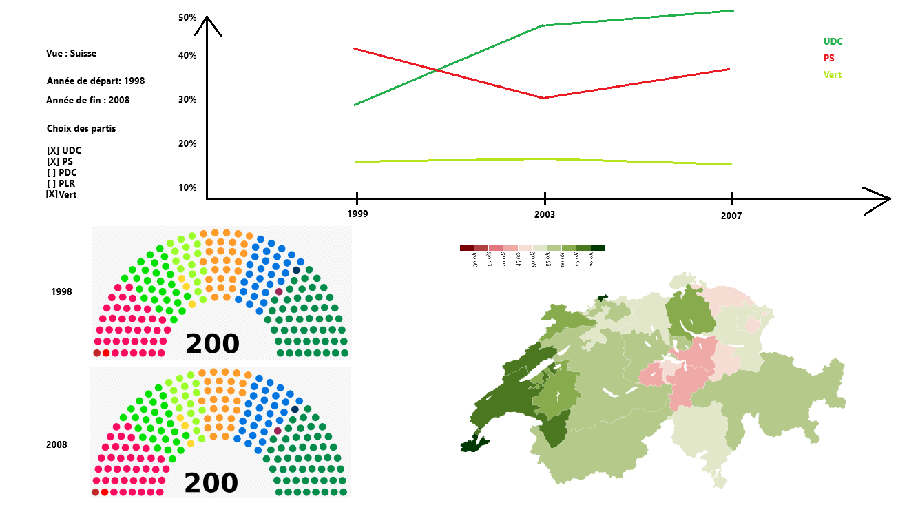

# Cours VI Visualisation de l'information

## Version exécutable

Vous trouverez dans "release" une version executable de notre programme pour Windows

## Dépendences

Les dépendences de ce projet sont : PyAxis, Matplotlib, CustomTkinter, GeoPandas et poli_sci_kit.

## Membres 

CAILLET Benjamin, DESSIEX Lea, SCHUPBACH Mathieu

## Objectif
Démontrer l'impact d’événements historiques sur la répartition des sièges à l'assemblée fédérale suisse.

Nous aspirons à offrir une représentation visuelle exhaustive de l'influence de divers événements historiques, tels que la chute du bloc soviétique, le 11 septembre et les manifestations pour le climat, sur la répartition des sièges à l'Assemblée fédérale suisse. Notre objectif est d'aider les parties concernées à mieux comprendre l'évolution des tendances politiques en Suisse.

## Maquette

## Liens Utiles

- [Documentation Geopandas](https://geopandas.org/en/stable/)
- [Projet GitHub Poli-Sci-Kit](https://github.com/andrewtavis/poli-sci-kit)
- [Documentation Altair](https://altair-viz.github.io/)

## Dataset

Le dataset utilisé pour ce projet est disponible sur le site de [BFS (Office fédéral de la statistique)](https://www.bfs.admin.ch/bfs/fr/home/statistiques/politique/elections.assetdetail.12967003.html).
